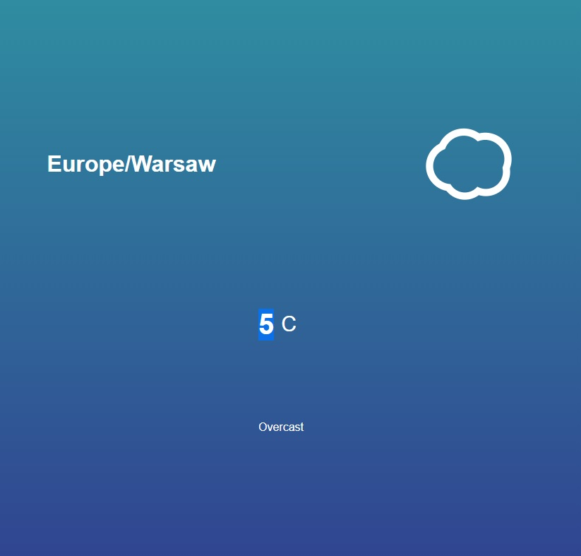

# weather-app
Simple weather app in VanillaJS to train basic skills

Used Dark Sky api to take weather depending on my location:
https://darksky.net/

Icons are animated from:
https://darkskyapp.github.io/skycons/

